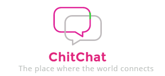
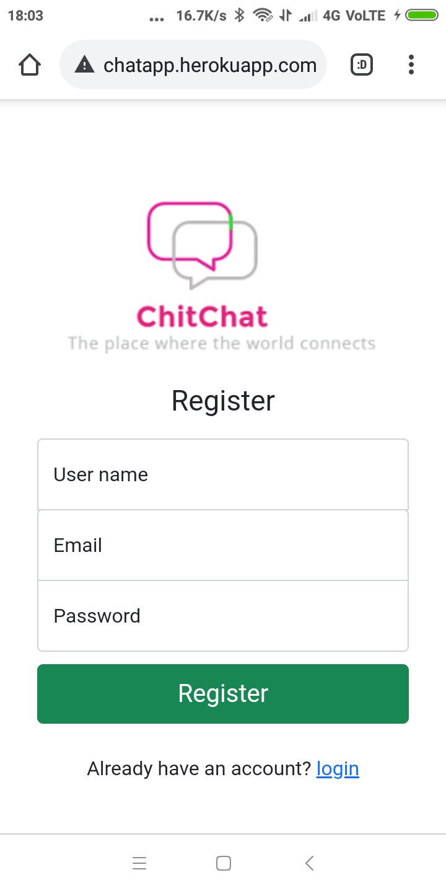
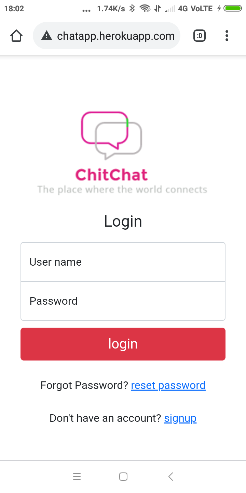
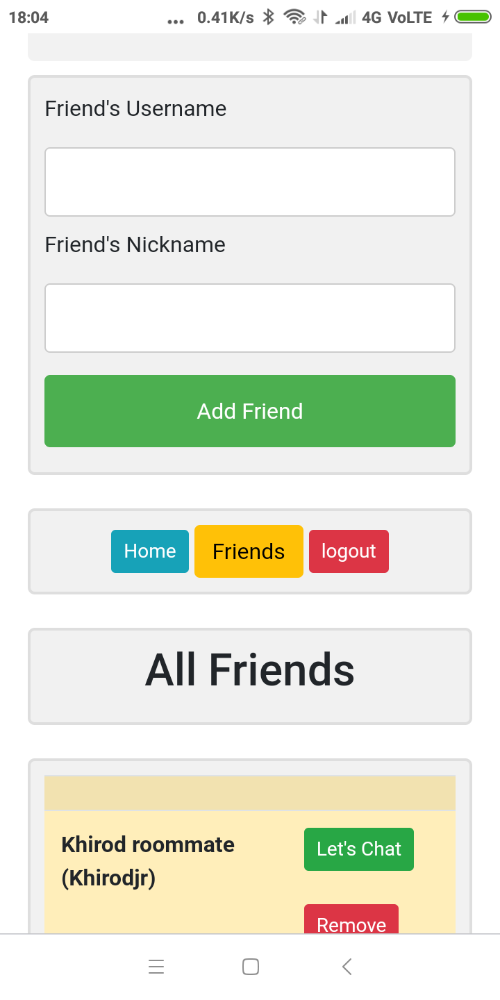
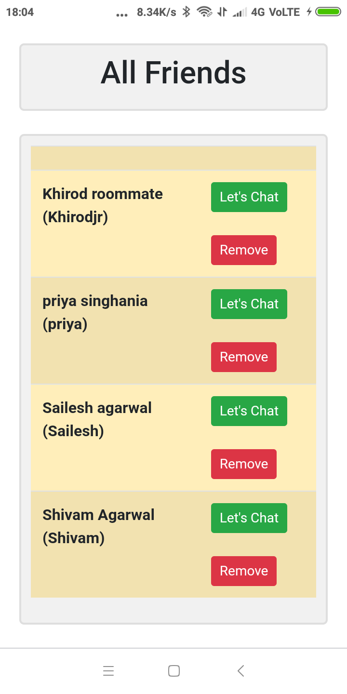
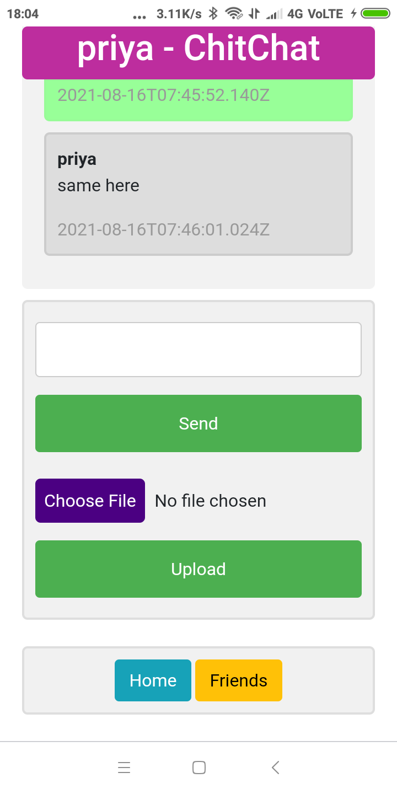
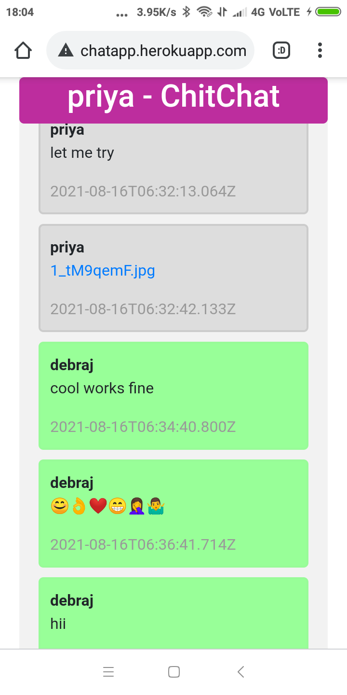
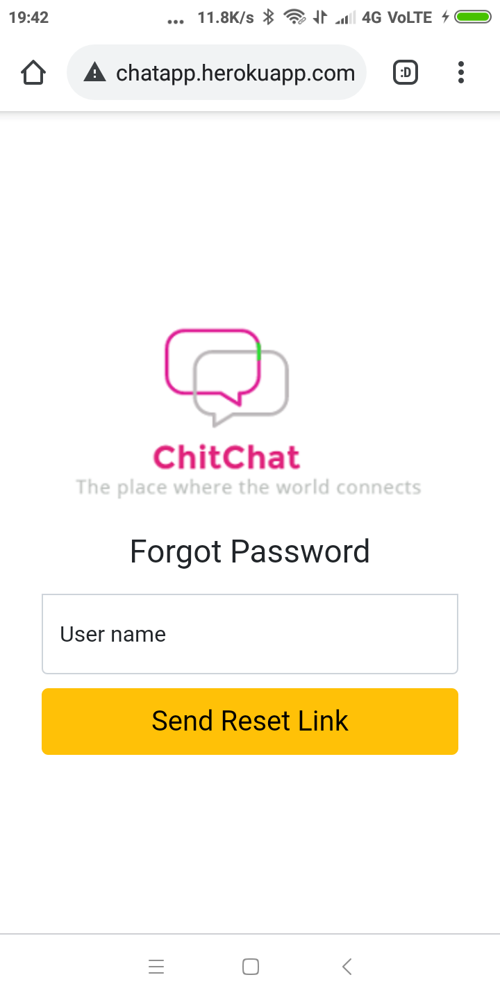

# ChitChat- A Django Chat Application
[](https://chitprivatechatapp.herokuapp.com/)
[](https://github.com/krishna-vasudev/ChitChat/discussions)
[](https://github.com/krishna-vasudev/ChitChat/blob/master/LICENSE)
[](https://chitprivatechatapp.herokuapp.com/)
<p align="center">
  
</p>

This is a Django chat application powered by Ajax, Jquery, Django Google Drive Storage that provides main features you'd expect from a chat, such as emoji message support, private chat, admin system, add friend, file sharing etc.

## Table of Contents
* [Introduction](https://github.com/krishna-vasudev/ChitChat#introduction)
* [Screenshots](https://github.com/krishna-vasudev/ChitChat#screenshots)
* [Demo and link to deployed chat application](https://github.com/krishna-vasudev/ChitChat#demo-and-link-to-deployed-chat-application)
* [Features](https://github.com/krishna-vasudev/ChitChat#-features)
  * [Current features](https://github.com/krishna-vasudev/ChitChat#current-features)
  * [Features to add](https://github.com/krishna-vasudev/ChitChat#features-to-add)
  * [Feature request](https://github.com/krishna-vasudev/ChitChat#-feature-request)
* [Technologies and tools used](https://github.com/krishna-vasudev/ChitChat#technologies-and-tools-used)
* [Prerequisites(Optional)](https://github.com/krishna-vasudev/ChitChat#prerequisitesoptional)
* [Installation and Setup(Optional)](https://github.com/krishna-vasudev/ChitChat#installation-and-setupoptional)
* [Running in the local server(Optional)](https://github.com/krishna-vasudev/ChitChat#running-in-the-local-serveroptional)
* [Deploying the app to heroku(Optional)](https://github.com/krishna-vasudev/ChitChat#deploying-the-app-to-herokuoptional)
* [Bug Reporting](https://github.com/krishna-vasudev/ChitChat#-bug-reporting)
* [License](https://github.com/krishna-vasudev/ChitChat#-license)


## Introduction
I had seen various chat application projects and tutorials in github ,youtube ,and other online resources. But in most of them it was a room where people can enter and chat, and security feature was not that good. So I decided to develop a chat application in django where one-to-one chat or private chat is possible keeping in mind the security features.

I had faced some difficulties while developing this application. I will brief about them and how to install it in your local system and run it in development server. The link to youtube video for deployment to heroku is provided [here](https://www.youtube.com/watch?v=UkokhawLKDU&list=WL&index=39).

## Screenshots
<p float="left" align="center">
  
   
</p>
<p float="left" align="center">
  
   
</p>
<p float="left" align="center">
  
   
</p>
<p float="left" align="center">
  
   
</p>

## Demo and link to deployed chat application
<p float="left" align="center">
  
</p>

The chat application is deployed in heroku platform. This is the link to the deployed application <b>:</b>
 [https://chitprivatechatapp.herokuapp.com/](https://chitprivatechatapp.herokuapp.com/)

I have also maade a detailed demo video for this webapp.
Check that out here <b>:</b>[https://youtu.be/-sf4CbjQKmk](https://youtu.be/-sf4CbjQKmk)

## 🚀 Features
### Current features
* An user can create an account ,the account will be verified through email.
* Private chat between two people is possible in the application.
* Messages can be text, emoji or even File uploads.
* Users can add friends by entering their unique usernames and chat with friends by just a click.
* If the user forgets his password then he can reset it by entering his username, which results in a  password reset email.
### Features to add
* I am also planning to add group chat feature to this application. I
* Also planning to add profile picture feature and advanced searching features to find friends.
* Time zone support for the message send/receive time.
* End to end encryption of messages for more privacy.

### ⭐ Feature request

* Any other feature you would like to suggest ,then please [open an issue](https://github.com/krishna-vasudev/ChitChat/issues) for that.😊
* Connect with me in [LinkedIn](www.linkedin.com/in/debraj-bhal-7597861b2). I did 💖 to hear how you feel using this app.
## Technologies and tools used
* [Django-python](https://www.djangoproject.com/)
* [Ajax request using Jquery](https://www.w3schools.com/jquery/ajax_ajax.asp)
* [Django Google Drive Storage](https://github.com/torre76/django-googledrive-storage/blob/master/docs/index.rst)
* [Html](https://www.w3schools.com/html/)
* [CSS](https://www.w3schools.com/Css/)
* [JavaScript](https://www.w3schools.com/js/DEFAULT.asp)
* [Python](https://www.python.org/doc/)
* [Bootstrap](https://getbootstrap.com/)
## Prerequisites(Optional)
As this is web application you can use it by simply visiting this link<b>:</b>[https://chitprivatechatapp.herokuapp.com/](https://chitprivatechatapp.herokuapp.com/).<br><br>
 But as a developer you might be interested to work on it or see it running in your local system. For that 
 you must have python installed in your system and all evironments settings done properly. Don't know how to install it ,see [this](https://www.youtube.com/watch?v=MoeQlmeJnPg) tutorial video for reference.
## Installation and Setup(Optional)
First clone this repository to your local machine using the following command in git bash<b>:</b>
```
$ git clone [URL]
```
Now open git bash in the root directory of the repository and enter the following command to install the required dependencies<b>:</b>
```
$ pip install -r requirements.txt
``` 
Inside the privatechat directory there is another directory named privatechat which is the django project directory. We have to make a few changes to /settings.py file in this directory.

First create a new google account and turn on less secure app permissions.See [this](https://devanswers.co/allow-less-secure-apps-access-gmail-account/) for reference.

Now in /settings.py file find the below code<b>:</b>
```
EMAIL_USE_TLS = True
EMAIL_HOST = 'smtp.gmail.com'
EMAIL_HOST_USER = 'Replace with google account you just created'
EMAIL_HOST_PASSWORD = 'Replace with password of your google account'
EMAIL_PORT = 587
```
Replace the required fields as mentioned in the above code.

Now we are almost done, we have just one more setting to do and the most tricky one.<br><br>
We will work on setting up django google drive storage. To use this storage you have to<b>:</b>
 * [set up a project and application in the Google Developers Console for newly created google account](https://console.cloud.google.com/flows/enableapi?apiid=drive)
 * [obtain the json private key file (OAuth 2.0 for Server to Server Applications) for your Google Project associated with Google Drive service](https://developers.google.com/identity/protocols/oauth2/service-account)

Put the downloaded json private key file inside the privatechat directory present in the root directory of the repository.


Find the below code in /settings.py file<b>:</b>
```
GOOGLE_DRIVE_STORAGE_JSON_KEY_FILE = os.path.join(BASE_DIR , "Replace with name of your json private key file")
```
So we are done✌. Just few more steps to get it running in local server.

## Running in the local server(Optional)
Open the git bash inside the privatechat directory present in the root directory of the repository.
Run the following commands in order one by one:
```
$ python manage.py makemigrations
$ python manage.py migrate
$ python manage.py runserver
```
Follow the link generated after last command and Hurrah!🎉 the app is running.

## Deploying the app to heroku(Optional)
Now although it's running good in local server but to deploy to heroku we have to make few more changes. Refer to [this](https://www.youtube.com/watch?v=UkokhawLKDU&list=WL&index=39) tutorial for detailed step by step deployment to heroku.

## 🐛 Bug Reporting
Feel free to [open an issue](https://github.com/krishna-vasudev/ChitChat/issues) on github if you find any bug.
## 📜 License
This software is open source, licensed under the [MIT License](/LICENSE).